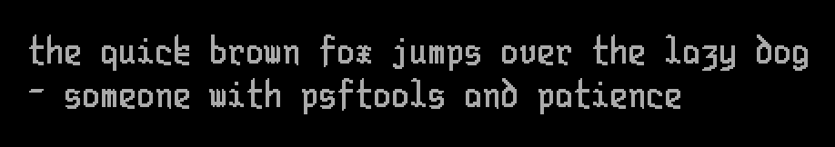
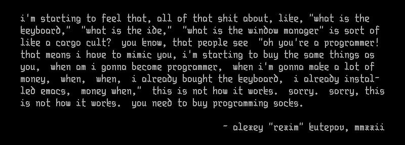

Frakturia
=========

A 10x24 bitmap fixed-width blackletter font for the Linux console.

> **Note**  
> This is not a "standard" font for use in a graphical environment. This font is
> meant to be used on a Linux console, _the_ Linux kernel console. It compiles
> to PSF and may not be usable in other environments.

The end goal is to support codepage 437 and Windows-1252.

To compile, you need `make`, a C preprocessor (bundled with any C compiler), and
`psftools`. You can check if you have them installed with `make deps`. Compile
by running `make` or `make frakturia.psf`.

This font is available under the Unlicense license. Feel free to learn from it
and incorporate it in your own projects.
